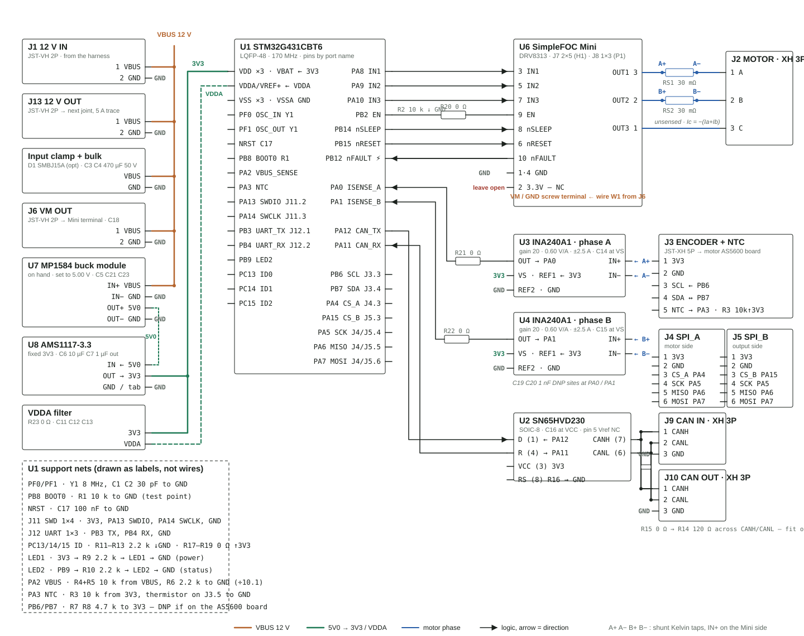

# 07 — Single-board BOM & wiring (spin 1, SimpleFOC Mini carrier)

Generated by `tools/gen_board_docs.py` from `hardware/bom/single_board_bom.csv` and `hardware/wiring/netlist.csv`. Edit the CSVs, not this file.

## Wiring diagram

Copper = VBUS 12 V (J1 in, J13 out to the next joint), green = 5V0 → 3V3 → VDDA, blue = motor phases, black = logic. `A+ A− B+ B−` are the shunt Kelvin taps, IN+ on the Mini side.

## Connections

### J7 — Mini H1 socket (2×5 male)

| Pin | Signal | Connects to | Notes |
|---|---|---|---|
| 1 | GND | GND |  |
| 2 | 3.3V-out | not connected | DRV8313 V3P3OUT 30 mA — never tie to the carrier 3V3 |
| 3 | IN1 | U1 PA8 (TIM1_CH1) | phase A PWM |
| 4 | GND | GND |  |
| 5 | IN2 | U1 PA9 (TIM1_CH2) | phase B PWM |
| 6 | nRESET | U1 PB15 | 10 k pull-up on the Mini; pulse low to clear a latched fault |
| 7 | IN3 | U1 PA10 (TIM1_CH3) | phase C PWM |
| 8 | nSLEEP | U1 PB14 | 10 k pull-up on the Mini; high = awake |
| 9 | EN | U1 PB2 via R20 (0 Ω); R2 10 k to GND | bridge-disable jumper R20 open for first power-up |
| 10 | nFAULT | U1 PB12 (TIM1_BKIN) | open-drain 10 k pull-up on the Mini; hardware break |

### J8 — Mini P1 socket (1×3 male)

| Pin | Signal | Connects to | Notes |
|---|---|---|---|
| 1 | OUT3 | J2.3 (phase C) | unsensed; Ic = −(Ia + Ib) |
| 2 | OUT2 | RS2 → J2.2 (phase B) | U4 IN+ on the Mini side IN− on the motor side |
| 3 | OUT1 | RS1 → J2.1 (phase A) | U3 IN+ on the Mini side IN− on the motor side |

### Mini screw terminal

| Pin | Signal | Connects to | Notes |
|---|---|---|---|
| VM | VBUS | J6.1 by wire W1 |  |
| GND | GND | J6.2 by wire W1 |  |

### J1 — 12 V in (JST-VH 2P)

| Pin | Signal | Connects to | Notes |
|---|---|---|---|
| 1 | VBUS | J13.1 (pass-through) · D1 · C3 · C4 · J6.1 · U7 IN+ · R4 | 12 V from the shared 5 A PSU; board rated 8–26 V |
| 2 | GND | J13.2 · GND |  |

### J13 — 12 V out (JST-VH 2P)

| Pin | Signal | Connects to | Notes |
|---|---|---|---|
| 1 | VBUS | next board's J1.1 | ≥ 2 mm trace from J1 — the first board carries the whole 5 A |
| 2 | GND | next board's J1.2 |  |

### J6 — VM out (JST-VH 2P)

| Pin | Signal | Connects to | Notes |
|---|---|---|---|
| 1 | VBUS | C18 · wire W1 to Mini VM |  |
| 2 | GND | wire W1 to Mini GND |  |

### U7 — MP1584 buck module

| Pin | Signal | Connects to | Notes |
|---|---|---|---|
| IN+ | VBUS | C5 to GND |  |
| IN− | GND |  |  |
| OUT+ | 5V0 | C21 · C23 · U8 IN | trim to 5.00 V before soldering the module in |
| OUT− | GND |  |  |

### U8 — AMS1117-3.3 (SOT-223)

| Pin | Signal | Connects to | Notes |
|---|---|---|---|
| IN | 5V0 | from U7 OUT+ | LDO drop 1.7 V at ~100 mA = 0.17 W |
| OUT | 3V3 | C6 · C7 · U1 VDD ×3 · U1 VBAT · R23 · U2 VCC · U3/U4 VS+REF1 · R3 · R9 · R17–R19 · J3.1 · J4.1 · J5.1 · J11.1 | fixed 3.3 V regardless of the module trimmer |
| GND / tab | GND |  |  |

### VDDA filter

| Pin | Signal | Connects to | Notes |
|---|---|---|---|
| R23 (0 Ω) | 3V3 → VDDA | C11 · C12 · C13 · U1 VDDA/VREF+ | ferrite site |

### U1 — STM32G431CBT6 support

| Pin | Signal | Connects to | Notes |
|---|---|---|---|
| 24 · 36 · 48 | VDD | 3V3 | C8 C9 C10 one per VDD pin |
| 1 | VBAT | 3V3 | C22 100 nF — VBAT is a separate pin from the three VDDs |
| 21 · 20 | VDDA · VREF+ | VDDA | C11 C12 C13 |
| 23 · 35 · 47 | VSS | GND |  |
| 19 | VSSA | GND |  |
| PF0 / PF1 | Y1 8 MHz | C1 C2 30 pF to GND | HSE drive = high (20 pF crystal) |
| NRST | C17 100 nF to GND |  |  |
| PB8 (BOOT0) | R1 10 k to GND | test point |  |
| PA2 | VBUS ÷ 10.1 | R4 + R5 (10 k) from VBUS; R6 (2.2 k) to GND | ADC1_IN3 |
| PA3 | NTC node | R3 (10 k) from 3V3; J3.5 | ADC1_IN4 |
| PA0 | ISENSE_A | U3 OUT via R21 (0 Ω); C19 DNP to GND | ADC1_IN1 |
| PA1 | ISENSE_B | U4 OUT via R22 (0 Ω); C20 DNP to GND | ADC2_IN2 |
| PA13 / PA14 | SWDIO / SWCLK | J11.2 / J11.3 |  |
| PB3 / PB4 | UART TX / RX | J12.1 / J12.2 |  |
| PB9 | STATUS_LED | R10 (2.2 k) → LED2 → GND |  |
| PC13 / PC14 / PC15 | NODE_ID0-2 | R11–R13 (2.2 k) to GND; R17–R19 (0 Ω) to 3V3 | strap = bit set |
| PB6 / PB7 | I2C1 SCL / SDA | J3.3 / J3.4; R7 R8 (4.7 k) to 3V3 DNP | AS5600 @0x36 |
| PA4 / PA15 | CS_A / CS_B | J4.3 / J5.3 | idle high |
| PA5 / PA6 / PA7 | SCK / MISO / MOSI | J4.4-6 and J5.4-6 in parallel | SPI1 |
| PA12 / PA11 | CAN TX / RX | U2 D (pin 1) / U2 R (pin 4) | FDCAN1 |

### U3 — INA240A1D (phase A)

| Pin | Signal | Connects to | Notes |
|---|---|---|---|
| 8 | IN+ | A+ = RS1 pad on the Mini side (Kelvin trace from the pad edge) | IN+ on the Mini side means positive current into the motor reads above 1.65 V |
| 1 | IN− | A− = RS1 pad on the motor side (Kelvin trace) | CAUTION pin 1 is the INVERTING input — the package is not numbered IN+ first |
| 2 | GND | GND |  |
| 4 | GND | GND | pin 4 is a second GND on the D package |
| 3 | REF2 | GND |  |
| 7 | REF1 | 3V3 | REF1 = VS with REF2 = GND puts the output at VS/2 = 1.65 V at zero current |
| 6 | V+ | 3V3 | C14 100 nF to GND |
| 5 | OUT | ISENSE_A via R21 (0 Ω); C19 DNP to GND | 0.60 V/A ±2.5 A -> U1 PA0 |

### U4 — INA240A1D (phase B)

| Pin | Signal | Connects to | Notes |
|---|---|---|---|
| 8 | IN+ | B+ = RS2 pad on the Mini side |  |
| 1 | IN− | B− = RS2 pad on the motor side |  |
| 2 · 4 | GND | GND |  |
| 3 | REF2 | GND |  |
| 7 | REF1 | 3V3 |  |
| 6 | V+ | 3V3 | C15 100 nF to GND |
| 5 | OUT | ISENSE_B via R22 (0 Ω); C20 DNP to GND | -> U1 PA1 |

### U2 — SN65HVD230 (SOIC-8)

| Pin | Signal | Connects to | Notes |
|---|---|---|---|
| 1 | D | U1 PA12 (FDCAN1_TX) |  |
| 2 | GND | GND |  |
| 3 | VCC | 3V3; C16 100 nF to GND |  |
| 4 | R | U1 PA11 (FDCAN1_RX) |  |
| 5 | Vref | not connected | also the NC pad for a TCAN332 |
| 6 | CANL | J9.2 · J10.2 · R14/R15 |  |
| 7 | CANH | J9.1 · J10.1 · R14/R15 |  |
| 8 | RS | R16 (0 Ω) to GND | high-speed mode (STB low on a TCAN332) |

### J9 / J10 — CAN in / out (JST-XH 3P)

| Pin | Signal | Connects to | Notes |
|---|---|---|---|
| 1 | CANH | U2.7 (paralleled) |  |
| 2 | CANL | U2.6 (paralleled) |  |
| 3 | GND | GND |  |

### CAN termination

| Pin | Signal | Connects to | Notes |
|---|---|---|---|
| R15 → R14 | CANH → CANL | 0 Ω + 120 Ω | populate on the two bus ends only |

### J2 — motor (JST-XH 3P)

| Pin | Signal | Connects to | Notes |
|---|---|---|---|
| 1 | A | RS1 motor side |  |
| 2 | B | RS2 motor side |  |
| 3 | C | J8.1 (Mini OUT3) |  |

### J3 — encoder + NTC (JST-XH 5P)

| Pin | Signal | Connects to | Notes |
|---|---|---|---|
| 1 | 3V3 | 3V3 | AS5600 board at 3.3 V |
| 2 | GND | GND |  |
| 3 | SCL | U1 PB6 |  |
| 4 | SDA | U1 PB7 |  |
| 5 | NTC | U1 PA3 node (R3 to 3V3) | thermistor from this pin to GND at the motor |

### J4 — SPI_A (1×6)

| Pin | Signal | Connects to | Notes |
|---|---|---|---|
| 1 | 3V3 | 3V3 | motor-side SPI encoder (future) |
| 2 | GND | GND |  |
| 3 | CS_A | U1 PA4 |  |
| 4 | SCK | U1 PA5 |  |
| 5 | MISO | U1 PA6 |  |
| 6 | MOSI | U1 PA7 |  |

### J5 — SPI_B (1×6)

| Pin | Signal | Connects to | Notes |
|---|---|---|---|
| 1 | 3V3 | 3V3 | output-side absolute encoder |
| 2 | GND | GND |  |
| 3 | CS_B | U1 PA15 |  |
| 4 | SCK | U1 PA5 |  |
| 5 | MISO | U1 PA6 |  |
| 6 | MOSI | U1 PA7 |  |

### J11 — SWD (1×4)

| Pin | Signal | Connects to | Notes |
|---|---|---|---|
| 1 | 3V3 | 3V3 |  |
| 2 | SWDIO | U1 PA13 |  |
| 3 | SWCLK | U1 PA14 |  |
| 4 | GND | GND |  |

### J12 — UART (1×3)

| Pin | Signal | Connects to | Notes |
|---|---|---|---|
| 1 | TX | U1 PB3 |  |
| 2 | RX | U1 PB4 |  |
| 3 | GND | GND |  |

## Bill of materials — one board

On hand 70 · on hand, confirm count 5 · **to buy 3** · optional 1 · DNP sites 4 (line-item quantities).

### Modules & ICs

| Ref | Qty | Value / part | Package | Status | Where | Notes |
|---|---|---|---|---|---|---|
| U1 | 1 | STM32G431CBT6 — MCU Cortex-M4F 170 MHz | LQFP-48 | On hand · confirm count | main controller | 3 needed for 3 boards — confirm count on hand |
| U2 | 1 | SN65HVD230DR — CAN transceiver 3.3 V 1 Mbps | SOIC-8 | On hand | CAN | footprint also fits TCAN332 (5 Mbps FD) later |
| U3 | 1 | INA240A1DR — current-sense amp gain 20 | SOIC-8 | On hand | phase A shunt RS1 | REF1 = 3V3 REF2 = GND → 1.65 V at 0 A |
| U4 | 1 | INA240A1DR — current-sense amp gain 20 | SOIC-8 | On hand | phase B shunt RS2 |  |
| U6 | 1 | SimpleFOC Mini v1.0 — DRV8313 3-phase driver module | 26×20 mm module | On hand · confirm count | power stage on J7 + J8; VM by wire from J6 | 3 needed — confirm count; check whether its headers are female (design files) or male |
| U7 | 1 | MP1584EN mini buck module — VBUS → 5.00 V (trim before fitting) | 22×17 mm module 4 pads | On hand · confirm count | 5V0 stage | on hand — 3 needed. A proven module instead of the discrete MP1584EN circuit (its BST/COMP values are not verified here); SS14 + CD43 stay in the drawer |
| U8 | 1 | AMS1117-3.3 — LDO 5 V → fixed 3.3 V | SOT-223 | On hand | 3V3 rail | makes 3V3 independent of the module trimmer; 0.17 W at 100 mA; also cleans VDDA |
| D1 | 1 | SMBJ15A — TVS 15 V standoff (12 V system) | SMB | Optional | across VBUS–GND at J1 | hot-plug transients only; SMBJ26A if the arm ever moves to 24 V |
| LED1 | 1 | Red 1206 — power LED | 1206 | On hand | 3V3 → R9 → LED1 → GND |  |
| LED2 | 1 | Red 1206 — status LED | 1206 | On hand | PB9 → R10 → LED2 → GND |  |

### Passives

| Ref | Qty | Value / part | Package | Status | Where | Notes |
|---|---|---|---|---|---|---|
| Y1 | 1 | 8 MHz — X49SM8MSD2SC crystal CL 20 pF | HC-49S SMD | On hand | PF0 / PF1 |  |
| C1 C2 | 2 | 30 pF — C0G | 1206 | On hand | Y1 load caps to GND |  |
| C3 C4 | 2 | 470 µF 50 V — electrolytic | Ø10 SMD | On hand | bulk across VBUS at J1 | all 6 on hand are used across 3 boards |
| C5 | 1 | 100 nF 250 V — X7R | 1206 | On hand | U7 IN+ to GND |  |
| C21 | 1 | 10 µF 25 V — X7R | 1206 | On hand | 5V0 at U7 OUT+ / U8 IN | 25 V part — never on VBUS |
| C23 | 1 | 100 nF 250 V — X7R | 1206 | On hand | 5V0 at U8 IN |  |
| C6 | 1 | 10 µF 25 V — X7R CL31B106KAHNNNE | 1206 | On hand | 3V3 at U8 OUT | 25 V part — 3V3 rail only |
| C7 | 1 | 1 µF 50 V — X7R | 1206 | On hand | 3V3 at U8 OUT |  |
| C8 C9 C10 | 3 | 100 nF 250 V — X7R | 1206 | On hand | U1 VDD pins one each within 2 mm |  |
| C11 | 1 | 10 µF 25 V — X7R | 1206 | On hand | VDDA |  |
| C12 | 1 | 100 nF 250 V — X7R | 1206 | On hand | VDDA |  |
| C13 | 1 | 1 µF 50 V — X7R | 1206 | On hand | VDDA / VREF+ |  |
| C14 C15 | 2 | 100 nF 250 V — X7R | 1206 | On hand | U3 U4 VS |  |
| C16 | 1 | 100 nF 250 V — X7R | 1206 | On hand | U2 VCC |  |
| C22 | 1 | 100 nF 250 V — X7R | 1206 | On hand | U1 VBAT (pin 1) to GND | the LQFP-48 has VDD on pins 24/36/48 plus a separate VBAT on pin 1 |
| C17 | 1 | 100 nF 250 V — X7R | 1206 | On hand | NRST to GND |  |
| C18 | 1 | 100 nF 250 V — X7R | 1206 | On hand | J6 VBUS to GND (HF at the Mini feed) |  |
| C19 C20 | 2 | 1 nF — ADC input RC | 1206 | DNP (site only) | PA0 PA1 to GND | site only — not in stock |
| R1 | 1 | 10 k — BOOT0 pull-down | 1206 | On hand | PB8 to GND + test point |  |
| R2 | 1 | 10 k — DRV_EN pull-down | 1206 | On hand | PB2 to GND | keeps the Mini disabled through reset |
| R3 | 1 | 10 k — NTC bias | 1206 | On hand | 3V3 to PA3 |  |
| R4 R5 | 2 | 10 k — VBUS divider top (series) | 1206 | On hand | VBUS → PA2 node |  |
| R6 | 1 | 2.2 k — VBUS divider bottom | 1206 | On hand | PA2 node to GND | 24 V reads 2.38 V; full scale 33.3 V |
| R7 R8 | 2 | 4.7 k — I2C pull-ups | 1206 | DNP (site only) | PB6 / PB7 to 3V3 | fit only if the AS5600 board has none |
| R9 R10 | 2 | 2.2 k — LED series | 1206 | On hand | LED1 LED2 |  |
| R11 R12 R13 | 3 | 2.2 k — node-ID pull-downs | 1206 | On hand | PC13 / PC14 / PC15 to GND |  |
| R14 | 1 | 120 Ω — CAN termination | 1206 | On hand | CANH–CANL via R15 | end nodes only |
| R15 | 1 | 0 Ω — termination select | 1206 | On hand | in series with R14 | fit on the two bus ends |
| R16 | 1 | 0 Ω — CAN RS to GND | 1206 | On hand | U2 pin 8 to GND | high-speed mode; is STB for a TCAN332 |
| R17 R18 R19 | 3 | 0 Ω — node-ID straps | 1206 | On hand | PC13 / PC14 / PC15 to 3V3 | fit to set a bit to 1 |
| R20 | 1 | 0 Ω — bridge-disable jumper | 1206 | On hand | PB2 → J7.9 EN | leave open for first power-up |
| R21 R22 | 2 | 0 Ω — ADC series (RC site) | 1206 | On hand | U3 / U4 OUT → PA0 / PA1 | 10 Ω later if the ADC needs it |
| R23 | 1 | 0 Ω — VDDA link (ferrite site) | 1206 | On hand | 3V3 → VDDA |  |
| RS1 RS2 | 2 | 30 mΩ 1 W 1 % — ERJ8CWFR030V | 1206 | On hand · confirm count | Mini OUT1 / OUT2 → J2 A / B | 6 needed for 3 boards — confirm count; Kelvin pads to U3 / U4 |

### Connectors

| Ref | Qty | Value / part | Package | Status | Where | Notes |
|---|---|---|---|---|---|---|
| J1 | 1 | JST-VH 2P right-angle — 12 V in from the harness | 3.96 mm THT | On hand | 1 VBUS · 2 GND | keyed — no reverse-polarity FET; the first board carries the whole 5 A |
| J13 | 1 | JST-VH 2P right-angle — 12 V out to the next joint | 3.96 mm THT | On hand | 1 VBUS · 2 GND | pass-through trace to J1 ≥ 2 mm wide (5 A) |
| J6 | 1 | JST-VH 2P right-angle — VM out to the Mini screw terminal | 3.96 mm THT | On hand | 1 VBUS · 2 GND |  |
| J2 | 1 | JST-XH 3P right-angle — motor phases | 2.54 mm THT | On hand | 1 A · 2 B · 3 C | ~3 A per contact — fine at 2.5 A peak |
| J9 | 1 | JST-XH 3P right-angle — CAN in | 2.54 mm THT | On hand | 1 CANH · 2 CANL · 3 GND |  |
| J10 | 1 | JST-XH 3P right-angle — CAN out | 2.54 mm THT | On hand | 1 CANH · 2 CANL · 3 GND |  |
| J3 | 1 | JST-XH 5P right-angle — AS5600 + NTC | 2.54 mm THT | On hand | 1 3V3 · 2 GND · 3 SCL · 4 SDA · 5 NTC | one cable to the motor |
| J4 | 1 | 1×6 female (cut from strip) — SPI_A — motor-side encoder upgrade | 2.54 mm SMT | On hand | 1 3V3 · 2 GND · 3 CS_A · 4 SCK · 5 MISO · 6 MOSI |  |
| J5 | 1 | 1×6 female (cut from strip) — SPI_B — output-side absolute encoder | 2.54 mm SMT | On hand | 1 3V3 · 2 GND · 3 CS_B · 4 SCK · 5 MISO · 6 MOSI |  |
| J11 | 1 | 1×4 female (cut from strip) — SWD | 2.54 mm SMT | On hand | 1 3V3 · 2 SWDIO · 3 SWCLK · 4 GND |  |
| J12 | 1 | 1×3 female (cut from strip) — UART | 2.54 mm SMT | On hand | 1 TX · 2 RX · 3 GND |  |
| J7 | 1 | 2×5 male pin header — Mini H1 socket — pads 1-10 of the U6 footprint | 2.54 mm THT | Buy | mates the Mini's female H1 | not a separate schematic symbol; it is part of U6 |
| J8 | 1 | 1×3 male pin header — Mini P1 socket — pads 11-13 of the U6 footprint | 2.54 mm THT | Buy | mates the Mini's female P1 | not a separate schematic symbol; it is part of U6 |

### Off-board

| Ref | Qty | Value / part | Package | Status | Where | Notes |
|---|---|---|---|---|---|---|
| RT1 | 1 | MF52E103 10 k NTC — motor winding thermistor | radial 1 mm | On hand | in the winding; on the J3 cable between pin 5 and GND |  |
| W1 | 1 | 2-wire lead ~5 cm — J6 → Mini screw terminal | VH housing + crimps | On hand | VBUS / GND |  |
| W4 | 1 | harness segment — J13 → next board's J1 alongside the CAN pair | VH housing + crimps | On hand | 12 V / GND | power and CAN run in one bundle |
| W2 | 1 | 3-wire motor lead — J2 → motor | XH housing + crimps | On hand | A / B / C |  |
| W3 | 1 | 5-wire encoder lead — J3 → AS5600 board + NTC | XH housing + crimps | On hand | 3V3 / GND / SCL / SDA / NTC | AS5600 board runs at 3.3 V |

### Mechanical

| Ref | Qty | Value / part | Package | Status | Where | Notes |
|---|---|---|---|---|---|---|
| PCB | 1 | 2-layer 1 oz ~60×60 mm — Lion Circuits |  | Buy |  | bottom layer = ground pour |
| M3 | 5 | M3 mounting holes — 4 on a 40 mm square + 1 under the Mini |  | On hand |  | thermal pad between Mini and carrier pour |

## Assembly notes

* **J7 pin 2 (Mini 3.3V-out) has no copper.** It is the DRV8313's 30 mA LDO; tying it to the carrier 3V3 parallels two regulators.
* **25 V 10 µF caps (C6, C11) live on the 3V3 rail only.** 100 nF 250 V and 1 µF 50 V are the parts that go on VBUS.
* **Trim U7 to 5.00 V on the bench before soldering it down**; the trimmer is hard to reach afterwards. U8 (AMS1117-3.3) then holds 3V3 fixed whatever the trimmer does.
* **Shunts are Kelvin-sensed**: U3/U4 IN+/IN− traces leave from the inner edge of the RS1/RS2 pads, never from the current path. IN+ on the Mini side = positive current into the motor.
* **First power-up**: R20 open, Mini unplugged, bench supply limited to 200 mA. Check 3V3, then fit the Mini, then R20.
* **Mini orientation**: silkscreen the H1 pin-1 corner and the P1 OUT3/OUT2/OUT1 order — a reversed Mini puts 24 V onto logic pins.
* **CAN termination R14/R15** only on the two boards at the ends of the bus.
* **Node ID**: R17–R19 strap PC13/14/15 to 3V3; the 2.2 k pull-downs R11–R13 are always fitted.
